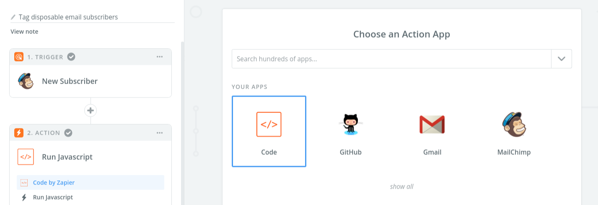

## Manage disposable emails in Mailchimp with Zapier and Identibyte

[Identibyte](https://identibyte.com) can help detect email addresses
that use a disposable or anonymous provider. These aren't so bad most
of the time, but when they get added to mailing lists like MailChimp,
you actually start paying real money for those resources that are
never used.

By connecting with Zapier, you can **use Identibyte to automatically
unsubscribe disposable email addresses** when they subscribe to your
lists.

#### How it works

This is completely handled through [Zapier](https://zapier.com), and
it takes 3 steps so it requires a [paid Zapier
account](https://zapier.com/app/settings/billing/plan/). We're working
on tighter integrations directly with these services so you don't need
to go through Zapier.

If you have the above, let's jump right in. Start by going in Zapier
and opening a blank **new Zap template**. Then follow these steps:

##### Step 1 Trigger
> Here we configure the MailChimp List is watch.

1. Select _Mailchimp_ as the first integration:
   

2. Select _New Subscriber_ as the Mailchimp trigger action:
   

3. Connect your MailChimp account
   

4. Select the _List_ to watch for subscribers:
   

5. Test your Zap and pull in any sample data you need:
   

##### Step 2 Trigger
> In this step, we got a new subscriber and check it with Identibyte

6. Select _Code by Zapier_ as the action integration:
   

7. Select _JavaScript_ as type of code to run:
   

8. Add input variables and code template. This part takes two steps,
   both are shown in the image below. First, create input variables
   for `emailAddress` and `apiToken`. For `emailAddress`, select the
   MailChimp field from the dropdown. For `apiToken`, copy a token
   from your [Identibyte dashboard](https://identibyte.com/dashboard)
   and paste it into the field.
   After that, copy and paste the script in the dropdown below in the
   _Code_ input in Zapier (**No changes are necessary to the code**).
   

     
Copy this code

       <pre>
         <code class="js lang-js">
const https = require('https')

/* Get input data from Zapier */
const email = inputData.emailAddress
const token = inputData.apiToken

/* What we give back to Zapier */
const out = {
    disposable: "false",
    freeProvider: "false",
}

const requestOptions = {
    host: 'identibyte.com',
    path: '/check/' + email + "?api_token=" + token,
}

// Make the API request and wait for the response
https.get(requestOptions, (res) => {
    let body = ''
    res.on('data', chunk => body += chunk)

    // Set `disposable` and `freeProvider` in the output
    res.on('end', () => {
        const response = JSON.parse(body)

        console.log(body,response)

        if (response.email.disposable === true) {
            out['disposable'] = "true"
        }

        if (response.email.free === true) {
            out['free'] = "true"
        }

        out['body'] = body
        out['emailChecked'] = email
    })
})

output = out
       </code>
     </pre>
   

   

9. Test the step and you should see green:
   

##### Step 3 action
> This is the last step, where we remove the subscriber from Mailchimp if the email address is disposable.

10. Select _MailChimp_ as the action integration:
    

11. Choose _Unsubscribe Email_ as the action for this step:
    

12. Select your _MailChimp Account_ (must be the same as **Step 1**
    settings).
    

13. Finalize the action by selecting the List (must be the same as
    **Step 1** above) the subscriber's email (use the **email** in the
    _MailChimp_ dropdown from Step 1). It's worth noting you can
    optionally _delete_ the subscriber -- right now we're only
    unsubscribing them.
    

## Conclusion

And that's about it! Now, when a new subscriber used a disposable
email address they will be **automatically unsubscribed from your
MailChimp account by Identiybte**.

Have any questions or problems setting it up? Let us know - we're
happy to help! Reach out to [Identibyte on
Twitter](https://twitter.com/Identibyte) or
[@CodyReichert](https://twitter.com/CodyReichert).

:: Cody Reichert
